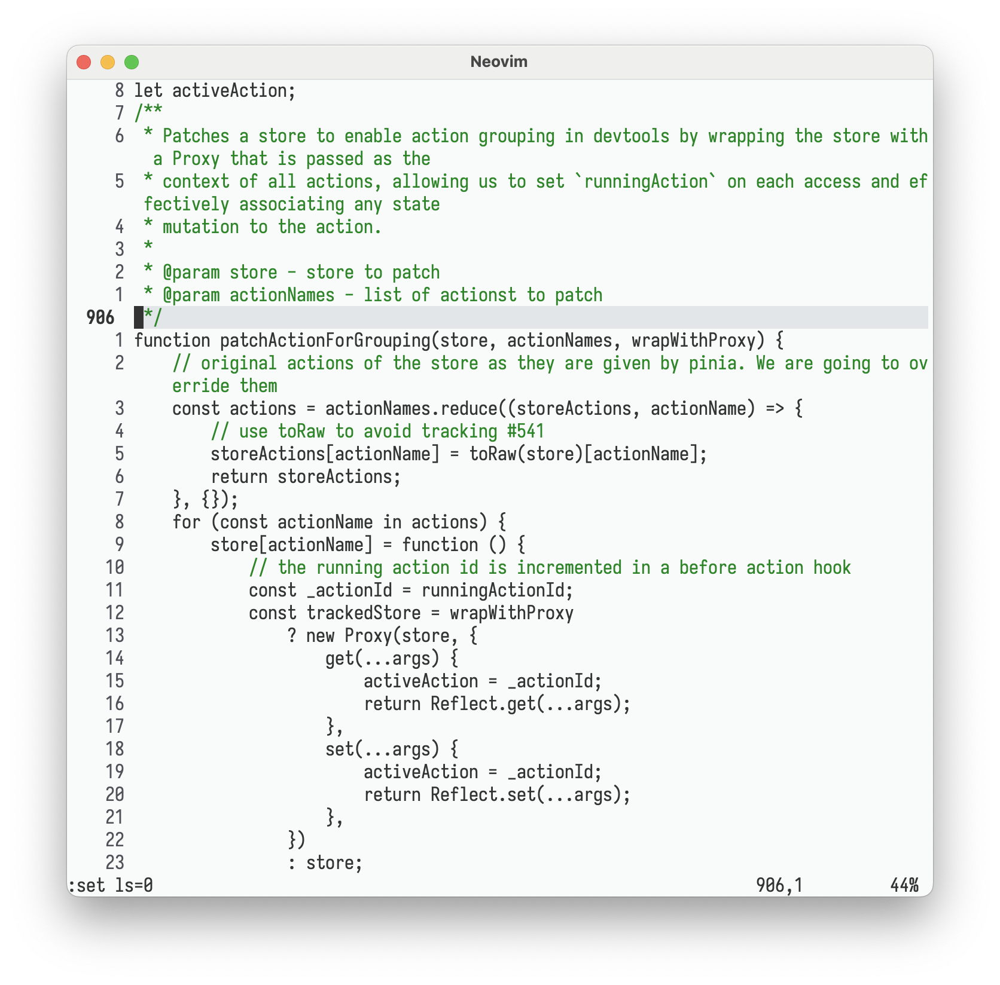

# Comments-only

**Work still in progress.**

Comments-only is a color scheme for vim and neovim which doesn't highlight anything
but comments.

## Similar colorschemes

- [Comments-only for Sublime Text](https://packagecontrol.io/packages/Comments-only%20Color%20Scheme)
